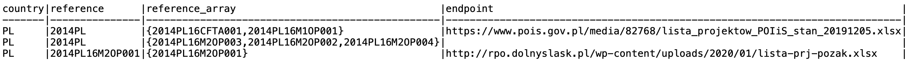
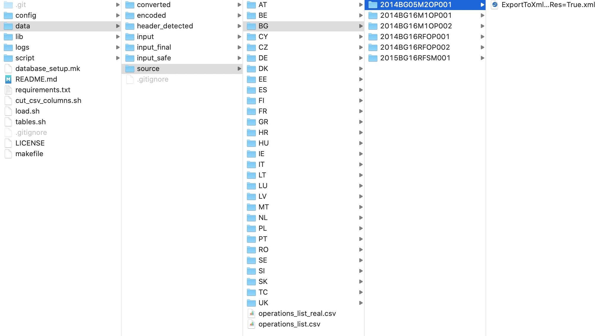
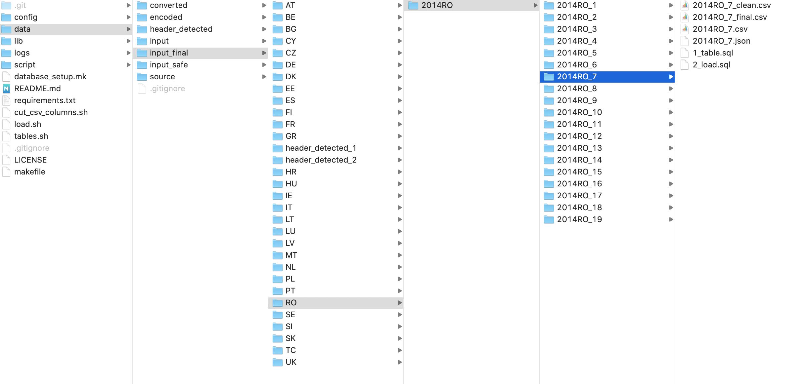

# Methodological report for the *"Pilot project to collect, clean and asses the list of operations produced by cohesion policy programmes at national, regional level"*

## 1. Introduction

This document is a part of deliverables defined by Service contract **No 2020CE16BAT015**. In the following we shall describe the methodologies implemented so far to meet the requirements of the named contract, and shall provide a draft of the steps yet to be implemented along with a draft for the final report.

## 2. Definition and collection of online data sources

The very first step was to define the exact website URL's containing the downloadable files for each regional and national cohesion policy programmes, since the list of known websites provided by the Comission - as part of the Service contract - contains mostly list pages, where typically a collection of files are available. In some cases these are historical versions of the same files, in other cases these list pages just contain links to further pages containing the files themselves. Further on, we will refer to the websites URL's containing the downloadable files as "endpoints".

In a few cases the "Download url plus readable format" column present in the file provided by the Commission was outdated (the links were broken or moved to a different address within the host), therefore where it was possible, we tried to relocate the the files in their new location.

In addition to collecting the endpoints themselves, the following columns were appendend to each endpoint:

- **Access**: a column defining if the the endpoint was accessible or not. Used for automated programatic access through scripts.

- **Anchor text**: if the link pointing to the file contained human readable text, it was saved in this column.

- **Last update**: if an anchor text was provided and a recognisable date format could be extracted from the text, it is saved here in `YYYY-MM-DD` format.

- **File format**: the column specifies the file extensions the original source data is stored in, which are used for automated programatic access through scripts. The values can be:
    - csv
    - xlsx (including xls)
    - ods
    - xml

- **compressed**: the boolean value specifies if the source file is compressed or not. Used for automated programatic access through scripts.

The contents of this table were shared with the Commission and went through multiple iterations by assigning a `master` copy within the CIRCABC portal, finally the Commission approved the contents which included their inputs and change requests. The approved copy of the `master` is accessible at the [following URL](https://docs.google.com/spreadsheets/d/1ZXkIOly8p6bSCed42YBd9KyYCbDyrnkSp8_MfJ6JXtk/edit?usp=sharing).

## 3. Collection of offline sources

Some of the files - e.g. the Hungarian and part of the Slovakian datasets - were not accessible online, however the Commission was able to get copies of the files. These were marked as `offline` in the data source table containing the endpoints and were included manually instead of accessing them programatically through public URL's.

## 4. Aggregation of programme codes and endpoints

In some cases, multiple programme codes were assigned to the same endpoint, therefore at this point a 1:1 relation between file and programme code could not be established, in other words it couldn't be recreated which programcodes belonged to the transactions stored in a specific file, as there were multiple matches. In order to be able to recreate this relationship between a transaction row and a programme code (in case there's any kind of reference of the programme code in the processed data), in such cases the programme codes were truncated to the first 6 characters, and the belonging original programme codes (those that shared the same endpoint file) were associated with this truncated version.

This relationship can be expressed with the following example:



## 5. Creating a folder structure according to programme codes

The above specified relations also specify the folder structure we prepare in the local filesystem to download the files to. An example of how the folder structure is created:



This structure is maintained in all transformation phases and the various transofrmation phases:

- 1. source
- 2. converted
- 3. encoded
- 4. input

Are separated from each other. In other words, the files are saved and stored after each step of transformation.

The folder structure is dynamically generated with each run, the basis being the contents and structure of the `master` data table.

## 6. Downloading of the files

The formerly specified logs then are accessed in a HTTP  GET request, and if successful - the request gets a 200 response code - are saved locally with the specified extension in the source `master` table. The reason for this is that the extensions used in the URL's themselves were not always correct, and automatic extension detection based on mime types did not always bring unbiased matches.

If the request was not successfull, we are logging the error. An example of the logged event of unsuccessfull download is the following:

```
2020-06-14 15:40:22,953 - Error occurred with downloading file
from https://www.espa.gr/el/Documents
ListOfOperations_20200128.zip
to folderdata/source//GR/2014GR16M1OP001
with fileformat: csv.
Message: ('Connection aborted.', OSError(0, 'Error'))
```

The files are saved in the correspoding folder, the original filename represented in the endpoint - with the exception of the extension - is maintained locally as well.

## 7. Uncompression of files

If a file is compressed, the programatic, automated uncompressing involves unnesting the structure within the compressed folder, meaning any nested folder structures are bypassed, and only the files are kept. These files then are moved to their root folder (named after either a programme code or a truncated, six character programme code at this point), and the discarded folders are cleaned up.

## 8. File conversions

In order to be able to load the files into a relational database, first we need to ensure that they are represented in a standard, valid and unified tabular format. The most common structure used for this is a comma separated file, so we will use this standard ([RFC4180](https://tools.ietf.org/html/rfc4180)).

The following steps are included during file conversion:

- If a file is already in .csv format, we move it to the next stage by copying it to the corresponding folder under the  `converted` folder branch, without any modification. This is a naive approach, trusting that the .csv file is valid. A possible improvement could be to validate if the rules of the applied .csv standard are respected.

- If a file is an Excel workbook (extension is .xsl or .xslx), we use the `xlrd` open source Python library to access the contents. We save each workshett in the workbook as a separate file, and to maintain their original order, we include their index in the filename. The strings used to identify the worksheet within the workbook (the tab's name) are truncated.

- If the file is an OpenDocument Spreadsheet (extension is .ods), we use the `ezodf` open source Python library to access the contents. The logic is the same as in the case with the .xls files: we save each worksheety separately, and indicate original index order in the filename. The strings used to identify the worksheet within the workbook (the tab's name) are truncated.

- Both the .xls and the .ods parser checks for merged cells. If a merged cell is detected, we take the value from the previous rows corresponding column (from the column index where we are in the present row). This is a first iteration and a naive approach, therefore it should be improved further, by logging this event in the file itself in a dedicated column. So for each row, we should have a column describing if there was unmerging within the scope of the actual row, and another column storing the number of unmerged cells. This way later on we can at least recall those rows which were heavyly contained merged cells, and filter them from the end results. A possible usecase could be Subtotal rows, which often come with merged cells.

- Both parsers remove linebreaks and newline delimiters from each cell's value in order to ensure a valid .csv structure safely. This transformation somewhat changes the end results (for example a long project description containing multiple paragraphs will be truncated into a single paragraph), but this we treated as a representational and not content specific issue.

- If the source file is stored in an .xml format, we simply flatten it to a comma separated format and move it to the next transformation stage. The so far detected .xml files only contained data only in the following structure: 

```
<Table>
  <Row>
    <Cells>
      <Cell>
        <Value>
          Example string
        </Value>
      </Cell>
    </Cells>
  </Row>
</Table>  
```
Therefore a more complex, recursive object parsing was not necessary and was not yet implemented.

As with every step, we log the errors in this step. An example logline looks like:

```
2020-06-17 16:31:43,192 - Error occurred with
./data/source/TC/2014TC16RFCB017/
20-03-19_Liste_der_Vorhaben.xlsx.xlsx
Message: Unsupported format, or corrupt file:
Expected BOF record; found b'\n\n<!DOCT'
```

## 9. Ensure UTF-8 encoding

In this step we try to encode all the contents into UTF-8 character encoding. If a character can't be converted to UTF-8, we discard it from the output of this step. This problem only appears with files where the source is stored in .csv format.

Many iterations were spent on automated character encoding, but with unsatisfactory results so far. Generally, if the encoding of the source file is not provided, it is more or less guesswork to try to find out which encoding is used. Since so far most of the files seem to retain their original contents, we accepted ignoring encoding errors and discarding the unconvertable characters as a good enough solution. One exception is some of the Greek files, where most of the contents have to be discarded. An improvement could be to provide the most possible encodings with each file based on their original language which can be detected based on the country codes in the programme codes.

## 10. Delimiter detection

At every usecase where we parse the files - from .xls, .ods or .xml formats - the delimiter is always a comma. However, some endpoints where data is stored in .csv format, there are other characters used for delimiting the columns, the semi-colon being one example in the Italian dataset.

For performance issues, we take the first 2 megabytes of the file available, and try to guess the most probable candidate for a delimiter. Than we standardize the file and ensure that the delimiter is always a comma.

If for some reason, a delimiter can not be automatically detected, we log the event. An example logline looks like:

```
2020-06-17 16:34:00,501 - Error occurred with delimiter
detecting file 
data/converted/TC/2014TC16RFPC001
Apr_Beneficiaries_Spreadsheet_PEACE_Webcopy_English_
0.XLSX.xlsx_2_Sheet1.csv from folder ""
Approved by SC
Draft LoO Issued
Final LoO Issued
LoO Accepted . 
Message: Could not determine delimiter
```
A possible reason for not being able to detect a delimiter is that the contents of the given spreadsheet are not actually tabulated. We have seen usecases where there's charts, free text is included in the spreadsheets. These would have to be manually examined based on the provided logs.

## 11. Removal of empty files

Some of the workbooks contain empty worksheets: they are created in the workbook, possiblty have a name, but contain no data. At this step, we clean these files up and delete if we created such an empty file with no data in it.

## 12. Automated header detection and file meta attributes logging

In this step, we try to detect the header line in the prepared files, since the header is not necessary contained in the first line - before the actual header many files have uncomplete or empty rows, or some rows containing free text as description of the contents.

For the header detection we applied the following logic:

- Starting from line one, we count the width (number of detected columns) of the line, excluding columns with empty string or NULL values. This integer will be our candidate for the width of the complete tabular data. We save this row as a possiblew candidate for header in a separate .json file.

- Then we iterate over all the rows of the file. If we encounter a row where the possible width - excluding empty rows - is greater than the formerly selected candidates width, we save this candidate to the .json output, and set the possible width of the tabular data to this integer.

- This iteration is continued until the last line of the file.

- If we encounter a column with a NULL value or empty string in the possoble candidates, we assign a `missing_column_name` value to it, and append it's index number among the rows columns which had NULL or empty value so far, so the second appearance of an empty column name for example becomes `missing_column_name_2`. This is to ensure that all missing columns with missing values have a unique names in the possible header candidate list.

- it is important that with this method, original column order is maintained!

- In the preserved json object we also log the index (row number) of the header candidate withing the file. We also store the current detected width belonging to the candidate. 

A meta log like the following example is saved for each file:

```
[
    {
        "content": [
            "Liste der Vorhaben / list of operations",
            "missing_column_name_1",
            "missing_column_name_2",
            "missing_column_name_3",
            "missing_column_name_4",
            "missing_column_name_5",
            "missing_column_name_6",
            "missing_column_name_7",
            "missing_column_name_8",
            "missing_column_name_9",
            "missing_column_name_10",
            "missing_column_name_11",
            "missing_column_name_12",
            "missing_column_name_13"
        ],
        "content_width": 14,
        "row_number": 0
    },
    {
        "content": [
            "Name des Begünstigten / beneficiary name",
            "Bezeichnung des Vorhabens / operation name",
            "Zusammenfassung des Vorhabens / operation summary",
            "Datum des Beginns des Vorhabens / operation start date",
            "Datum des Endes des Vorhabens / operation end date",
            "Gesamtbetrag der förderfähigen Ausgaben des Vorhabens / total eligible expenditure allocated to the operation",
            "Unions-Kofinanzierungssatz pro Prioritätsachse / Union co-financing rate, as per priority axis",
            "Durchführungsort / location",
            "Land / country",
            "Interventionskategorie / name of category of intervention",
            "missing_column_name_1",
            "missing_column_name_2",
            "missing_column_name_3",
            "missing_column_name_4"
        ],
        "content_width": 14,
        "row_number": 5
    },
    {
        "content": [
            "A & L StoneROB OHG",
            "Erschließung des Zielmarktes USA",
            "Export von Produkten in die USA und Anpassung der Webseite und Prospekte auf den amerikanischen Markt. ",
            "43790.0",
            "44155.0",
            "40000.0",
            "25%*",
            "Kirchberg , Wald",
            "Deutschland",
            "066 - Fortgeschrittene Unterstützungsdienste für KMU und KMU-Zusammenschlüsse (einschließlich Dienstleistungen für Management, Marketing und Design)",
            "01 - Nicht rückzahlbare Finanzhilfe",
            "03 - Ländliche Gebiete (dünn besiedelt)",
            "07 - Nicht zutreffend",
            "03 - Stärkung der Wettbewerbsfähigkeit von kleinen und mittleren Unternehmen"
        ],
        "content_width": 14,
        "row_number": 7
    }
]
```

As it is observable, column names could not always be captured - mainly due to merged cells across multiple rows - but this solution produced a good enough result to proceed to the next step. 

## 13. Manual validation of selection of header from possible candidates

From the generated .json logs in the previous step, we felt necessary to include a manual supervision of the prepared files. The main argument for this is that a manual / human intelligence driven mapping (translation) of column names is necessary regardless, so there would be a manual step perforce. The mapping would be included in this step later.

The manual supervision includes going through all the generated candidate lists, and only keep one object, which resembles most the headers - even if with some destroyed or unrecognizable column names. The row number should be a very good indicator - if it is larger than 10 in our heuristic experience it is likely that we missed the actual header.

The manual supervision is also useful for detecting those prepared files which are actually not containing tabular data.

For these usecases the .json file should contain an empty array (`[]`).

## 14. Column name transformations

Once a possible candidate is selected, we transform the column names so they became valid accoring to SQL standards. The following transformations are carried out:

- spaces, linebreaks and tabs are replaced with underscore characters (`_`).

- accented characters are replaced with non accented characters.

- only alphanumerical characters are kept, with the exception of underscore characters. Other characters are escaped.

- every character is lower cased.

- if the column name string after transformations is longer than 63 characters - the SQL column name character limit - we truncate the the rest of the string.

- if there are multiple column name values with the same value, we preprend and underscore and an index of the encountered duplication within the array, ensuring that column names are unique - also an SQL requirement.

- the transformed header is also appended to the .json log for later reuse, as a separate object from the original detected header.

## 15. Ensuring header is the first row

Once the final candidate for header is selected and column values are transformed to be SQL compatible, we reach back to the `row_number` attribute exposed earlier, and remove all rows which index is smaller or equal than the value of the attribute. As a next step, we prepend the final header row to the remaining data, thus ensuring that the validated header is the first row.

## 16. Removal of empty columns

PostgreSQL limits the number of columns at 16 000 for a single table. Unfortunately, one of the Dutch files - endpoint belonging to programme code **2014NL16RFOP004** contains more than 16 000 columns. These columns are declared in the .csv file (that is the format the source file is provided in), but contain no value. The file is clearly damaged, but this usecase called for the need to throw away all columns, which have all NULL values across all rows / in other words, we will discard a column if it is declared (even if it has a valid column name), but has no value for any of the rows within the file.

## 17. Renaming files according to generated programme codes and preparing table names

Finally we rename all files to their respective programme code, with a .csv extension. These files will still reside in a folder structure following the programme codes. If there are multiple files belonging to a programme code - either because there are multiple worksheets within a single endpoint containing a workbook, or there are multiple endpoints belonging to the same programme code - we sort the original filenames in aplhabetical order (where the worksheet index maintains the original order of tabs) and assing an index to them delimited by an underscore. This will provide us with the following folder structure:



This way we ensure a hierarchy that contains single files at the lowest branch of the tree, while maintaining Programme code relations to the fullest extent possible. The table names in the relational database will follow this convention, therefore there will be a table named `2014RO_7` which contains the example file cited above.

## 18. Autogeneration of SQL table creation scripts

Once we have the above folder structure autogenerated and the corresponding validated .csv files, we can start autogenerate the table creation scripts for the database.

Since at this point we do not know what datatypes the specific columns contain, and we cannot be sure if the values themselves are actually valid to those datatypes, we will create a raw schema and materialize the table within that schema. As we want to a 1:1 representation of the input file (which at this point includes the above mentioned transformations), we will just declare everything as text, and later assing strict datatypes to each columns as the data cleaning and column value transformations take place.

The column names are declared after the transformed and validated header files, order of columns in the original source file is also maintained.

As mentioned earlier, the tables will be named after the Programme codes maintaining uniqeness, and we also ensure that the job will run even if the database already has the specified table created (by always dropping the table first and then recreating it with each job / load).

Example of an autogenerated table creation script:

```
DROP TABLE IF EXISTS raw."2014HR16M1OP001_1";

CREATE TABLE raw."2014HR16M1OP001_1" (
  "naziv_projekta" TEXT COLLATE "default",
  "fond" TEXT COLLATE "default",
  "operativni_program" TEXT COLLATE "default",
  "nutsii" TEXT COLLATE "default",
  "zupanija" TEXT COLLATE "default",
  "korisnik" TEXT COLLATE "default",
  "opis_projekta" TEXT COLLATE "default",
  "datum_ugovaranja" TEXT COLLATE "default",
  "zakljucni_datum_provedbe_aktivnosti" TEXT COLLATE "default",
  "bespovratna_sredstva" TEXT COLLATE "default",
  "ukupno_prihvatljivi_troskovi" TEXT COLLATE "default",
  "status_projekta" TEXT COLLATE "default"
)

WITH(OIDS=false);
```

## 19. Autogeneration of SQL loading scripts

Once we have the table creation scripts autogeneration, we just need to autogenerate the loading scripts. This is very similar to the table creation script, with one important detail: by declaring the column names themselves in the loading script, we ensure that only these columns will be loaded.

If the source file contains some rogue rows or shifted columns, where actually there's more values than the declared columns (a common problem with the .csv file format), we will bypass this as we declare the exact columns we would want to load and those are the exact same columns we created the table with (source of both is the validated header).

This ensures that the loading will happen without errors.

Example of autogenerated load script:

```
\copy raw."2014HR16M1OP001_1" (
  "naziv_projekta",
  "fond",
  "operativni_program",
  "nutsii",
  "zupanija",
  "korisnik",
  "opis_projekta",
  "datum_ugovaranja",
  "zakljucni_datum_provedbe_aktivnosti",
  "bespovratna_sredstva",
  "ukupno_prihvatljivi_troskovi",
  "status_projekta")
FROM 'data/input_final/HR/2014HR16M1OP001/2014HR16M1OP001_1/
2014HR16M1OP001_1_final.csv'
DELIMITER ','
CSV HEADER;
```

## 20. Preparing database and autocreating schemas

We prepare the database in a standalone manner, meaning that with each run every dependency (schema creation, creation of user defined functions, granting user privileges, building indexes if necessary, etc.) is built from scratch if not present.

This way we ensure that the project can be deployed at any newly created instance, given that a user and a default database is created.

## 21. Autoloading files into autogenerated SQL tables 

Finally we automate the generation of tables with the help of the formerly described create scripts: the last input stage folder structure is walked through programatically, and if we find a file named `1_table.sql` we automatically execute it with parameterized variables (host, database, user, password, etc.) declared from configuration files.

After creating all the necessary tables, we load the files into the tables with the detection of `2_load.sql` scripts in the same manner.

Errors are piped into separate logfiles dedicated to this step.

## 22. Workflow management

The above detailed workflow is orchestrated by makefiles, Python and shell scripts. Workflow dependencies are declared in the makefiles.

Enviromental variables are stored and loaded from configuration files.

## 23. Version control

The project's source code is stored in a Github repository, which is currently a private repository aligned with the Commisions privacy requirements (the source code at this point should not be publicly accessible).

Upon request access can be provided to the repository [EU1420](https://github.com/balkey/eu1420).